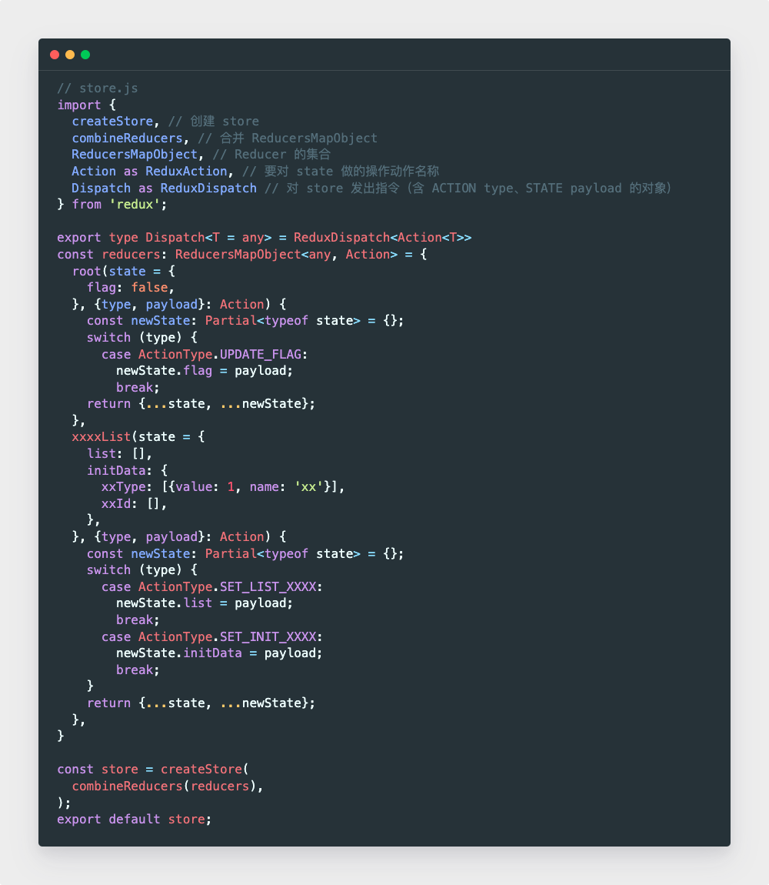
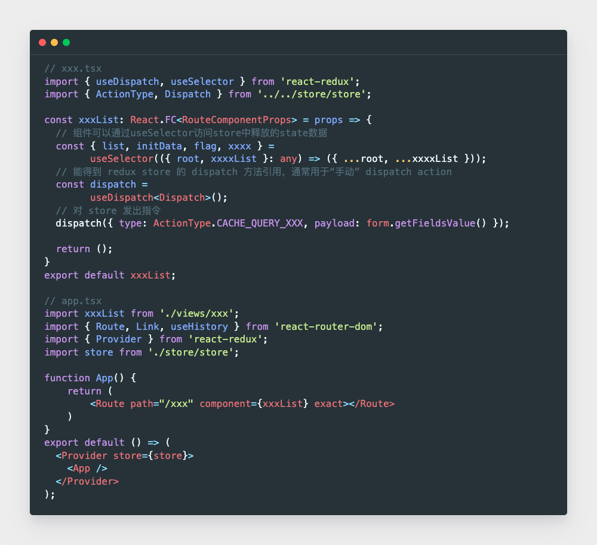

# 一、组件基础

## 1. 事件机制

- JSX 的事件没有绑定在真实 DOM 上，而是事件代理统一绑定在 document 上
- 原因：为了减少内存 + 挂载销毁时统一订阅移除
- document 事件也不是原生浏览器事件，不想冒泡的话，调用 event.stopPropagation 阻止冒泡[无效]，而是 event.preventDefault[阻止默认行为]

## 4. 高阶组件、props、hooks 区别

1. hoc 接收一个组件和额外参数，返回一个新组件，纯函数无副作用，逻辑复用
2. Render props 接收函数，将 render 逻辑注入到组件内部
3. hooks 16.8 解决 hoc props 重名 解决 props 因共享数据出现嵌套地域问题 能在 return 外使用数据

## 5. react-fiber

- 一种 CPU 调度架构，合理分配 CPU 资源，避免一次性操作大量节点

## 6. 和 React.PureComponent 的区别

- 组件更新时，如果组件的 props 和 state 都没有改变，render 函数就不会触发
- 自动执行 shouldComponentUpdate（会 return false 阻止页面更新） 浅比较
- 省去虚拟 DOM 生成对比过程，提升性能

## 8. React.createClass 和 extends Component 的区别有哪些？

- 语法区别 前者函数 后者不是
- prop 区别 前者 propType 和 getDefaultProps 来设置获取，后者 proptypes defaultProps
- 状态区别 前者 getInitialState()方法返回初始化状态对象 后者 在 constructor 设置
- this 区别 前者正确绑定 this 后者传引用隐式绑定会丢失 this 不会自动绑定到类的实例上

## 10. 对 componentWillReceiveProps 的理解

- props 发生变化是执行，在 render 函数前执行，在接收到新 props 执行
- 应用：请求资源，不必将请求全部放在父组件中，而是放在子组件的这个生命周期里

## 11. 哪些方法触发 render 重新渲染，会做些什么

- setState 被调用
- 父组件重新渲染

- 做什么？
  - 新旧树深度优先遍历对比，有差异就放在一个对象里面
  - 遍历差异对象，根据对应规则更新 vnode

## 12. React 如何判断什么时候重新渲染组件

- 将要渲染组件时
- 执⾏ shouldComponentUpdate 是否返回 true （组件应该更新，也就是重新渲染）
- 通过重写 shouldComponentUpdate 看他是否返回 true / false

## 13. 声明组件的方法

1. 函数式定义的 ⽆状态组件 ES5 原⽣⽅式
2. React.createClass 定义的组件
3. ES6 形式的 extends React.Component 定义的组件

## 14. 对有状态组件和⽆状态组件的理解及使⽤场景

- 有状态
  - 类组件 继承 生命周期 this state 维护状态变化
- 无状态
  - 相反 专注于 render 纯展示 如 button

## 15. fragment 理解

- 为了不添加多余 DOM 节点
- 可以用 fragment 包裹现有元素，无需渲染，无需向 DOM 添加额外节点

## 17. React 中可以在 render 访问 refs 吗？为什么？

- 不可以
- render 阶段 DOM 还没生成，无法获取到

## 18. 对 Portals 插槽理解

- 将子节点渲染到存在于父组件之外的 DOM 节点的方案
- ReactDOM.createPortal(child, container);
- 应用：
  - 父组件 overflow:hidden z-index 时，被其他元素阻挡，考虑用 Portals 脱离父组件

## 19. 如何避免不必要的 render

- shouldComponentUpdate 和 PureComponent
- 高阶组件，函数无 shouldComponentUpdate 但可以封装一个 purecomponent
- React.memo 缓存组件渲染，避免不必要更新 只用于函数组件

## 21. context 理解

- 特定一个组件树中共享的 store
- 不想逐层传 props state 时，用 context 跨组件传
- 就像作用域一样，能让子组件轻松获取上层父组件的属性

## 23. 受控组件 非受控组件

- 受控组件
  - 有事件处理函数 onChange
  - 渲染出的状态和 组件的 value 相对应
  - 缺点：多个组件时，想获取全部状态就需要全部调用事件处理函数
- 非受控组件
  - 没有 value props
  - 通过 ref 来从 DOM 节点获取表单数据`<input type="text" ref={(input) => this.input = input}`
- 总结：
  - ⻚⾯中所有输⼊类的 DOM
  - 如果是现⽤现取的称为⾮受控组件，
  - ⽽通过 setState 将输⼊的值维护到了 state 中，需要时再从 state 中取出，这⾥的数据就受到了 state 的控制，称为受控组件。

## 24. refs 作用 和 应用场景

- 通过 ref 可以访问在 render 中创建的 React 元素或者 DOM 节点
- React.createRef 创建，将 ref 属性加到 React 元素上
- 要在整个组件用 refs 必须把 ref 分配给 实例属性

```js
class MyComponent extends React.Component {
  constructor(props) {
    super(props);
    this.myRef = React.createRef();
  }
  render() {
    return <div ref={this.myRef} />;
  }
}
```

- ref 的返回值取决于节点的类型：
  - 当 ref 属性被⽤于⼀个普通的 HTML 元素时，React.createRef() 将接收底层 DOM 元素作为他的 current 属性以创建 ref 。
  - 当 ref 属性被⽤于⼀个⾃定义的类组件时， ref 对象将接收该组件已挂载的实例作为他的 current 。
  - 当在⽗组件中需要访问⼦组件中的 ref 时可使⽤传递 Refs 或回调 Refs。

```js
import React, { Component } from "react";
import { OpenSheetMusicDisplay } from "opensheetmusicdisplay";
import AudioPlayer from "osmd-audio-player";
import "./Score.css";

class Score extends Component {
  constructor(props) {
    super(props);
    this.state = {
      file: props.file,
    };
    window.audioPlayer = new AudioPlayer();
    this.divRef = React.createRef();
  }

  play() {
    window.audioPlayer.play();
  }

  pause() {
    window.audioPlayer.pause();
  }

  stop() {
    window.audioPlayer.stop();
  }

  async componentDidMount() {
    this.osmd = new OpenSheetMusicDisplay(this.divRef.current, {
      autoResize: false,
    });
    await this.osmd.load(this.state.file);
    await this.osmd.render();
    await window.audioPlayer.loadScore(this.osmd);
  }

  render() {
    return (
      <div>
        <div class="controls">
          <button onClick={this.play}>Play</button>
          <button onClick={this.pause}>Pause</button>
          <button onClick={this.stop}>Stop</button>
        </div>
        <div class="ref" ref={this.divRef} />
      </div>
    );
  }
}

export default Score;
```

这个 OSMD 主要做了

- 在构造函数中，创建 ref
- 在 render 中给元素添加 ref 属性
- 此时已经有个元素 有 ref 属性了
- 在 componentDidMount 钩子中，获取 ref 的 current，此时因为是 html 元素，所以 current 是他的 DOM 元素
- OpenSheetMusicDisplay 就是在这个 ref 上挂载了生成的元素，并配置 file、render，此时乐谱已经挂载好了
- 又通过 AudioPlayer 库在 window 上创建音频

# 25. 除了在构造函数中绑定 this，还有别的方式嘛？

1. 构造函数中 this.handleClick = this.handleClick.bind(this)
   - 原因：隐式绑定丢失 this，必须在创建该函数时强制绑定
2. 用箭头函数在函数定义的时候，箭头函数的 this 会被函数词法作用域约束
3. 组件中函数调用的时候 .bind(this)

# 26. 组件的构造函数有什么用？是必须的嘛？

1. 分配给 this.state 初始化本地状态
2. 将事件处理方法绑定到实例上

- 必须配上 super，如果要在构造函数中使用 this.props 就要传 props

# 28. 类组件 和 函数组件异同

- 相同：都是为了渲染 react 元素
- 不同：
  - 类组件基于面向对象，继承、生命周期；函数无副作用、引用透明
  - 性能优化：类组件通过 shouldComponentUpdate 阻断渲染，函数依靠 React.memo 缓存渲染结果

# 二、数据管理

## 1. setState 调用原理

- setState()用于更新状态，它接受两个参数，第一个参数可以传入一个对象，也可以传入一个 updater 函数。
  - 传入的对象代表需要更新的状态及状态值。
  - updater 为一个带有形参的函数，返回被更新的状态对象，可以接收到 state 和 props；
- 第二个参数是一个可选的回调函数，在状态更新完后进行回调。setState()并不会立即执行状态的更新，而更像是更新状态请求。

- 在调用 setState()后 React 会调用 enqueueSetState()方法将需要更新的 state 入队。
- 接着调用 enqueueUpdate 方法里面的 batchingStrategy.isBatchingUpdates 属性判断当前是否处理批量更新的阶段。
- 若处于，则将需要更新 state 的组件放入 dirtyComponent 队列中等待下一次批量更新；若不处于则立即更新组件。

## 2. setState 调用后发生了什么？同步还是异步？

1. 发生了什么？

- 将传入的参数对象和组件当前状态合并，然后用新的状态创建 DOM 树，计算新树和老树的节点差异，进行最小化重渲染
- 如果短时间频繁 setState，会将 state 的改变压入栈中，合适的时机批量更新 state

2. 同步还是异步？

- 源码通过 isBatchingUpdates true or false 判断 先存进 state 队列还是马上更新
- 异步：react 可以控制的地方，生命周期、合成事件
- 同步：无法控制的地方，原生事件、setTimeout、addEventListener、setInterval

- 主要是异步：
  - 原因：
  - 同步的话，每次 setState 就要更新，太频繁会降低效率
  - 如果同步更新了 state，但没执行 render，当前 state 和 props 不能保持同步，出现问题

## 3.批量更新过程是什么

- 会将多次 setState 状态修改合并成一次状态修改
- `!!!同一个方法多次setState合并动作不能单纯将更新累加，只能保存最后一次更新`

## 5. setState 第二个参数作用

- 可选的回调函数
- 会在 componentDidUpdate 执行

## 8. state 怎么注入到组件的，从 reducer 到组件经历了什么样过程

## 9. state 和 props 区别

1. props 【传递给组件的】从父组件向子组件传递数据，可读性，不变性
2. state 【组件自己管理的】组件保存控制修改状态，在 constructor 初始化，通过 this.setState 修改

## 10. props 为什么可读

只能从父组件流向子组件
纯函数：相同类型输入输出、无副作用、不依赖外部状态

## 11. props 改变时，更新组件的有哪些方法

- componentWillReceiveProps

  - 将新的 props 更新到组建的 state 中
  - 对比旧的和新的 props，从而更新
  - 应用：在子组件中数据请求，不需要在父组件中请求，能减轻负担

- 16.3 有新的钩子函数：getDerivedStateFromProps 实现
  - 静态函数，不能直接访问属性，只能通过参数
  - 提供的 nextProps 和 prevState 来判断，将新 props 映射到 state

# 三、生命周期

## 1. 生命周期有哪些？

装载（第一次 DOM 被渲染）、更新（组件状态变化）、卸载（组件被移除）

1. 装载

- constructor
  - super(props)
  - 初始化 state
  - 事件处理绑定 this
- getDerivedStateFromProps
  - 接收 nextProp 和 prevState
  - 返回新 state 对象 或 null（不需要更新）
- render
  - 返回 react 元素：包括原生
  - fragment 片段：返回多个元素
  - Protals：将子元素渲染到不同 DOM 子树中
  - text 节点
  - null 或 bool 值
- componentDidMount
  - 发送网络请求
  - 添加订阅消息
  - 如果调用 setState，要触发额外渲染 + render 函数
  - 尽量在 constructor 中 state 初始化

2. 组件更新阶段

- getDerivedStateFromProps
- shouldComponentUpdate(nextProps, nextState)
  - 触发渲染条件：setState 或 父组件重新渲染
  - 比较 this.props 和 nextProps state 也是一样
  - 不建议用深拷贝来比较，效率比重新渲染组件还低
- getSnapshotBeforeUpdate 和 componentDidUpdate 一起使用
- componentDidUpdate
  - 更新后立即调用
  - 此处进行网络请求
  - 三个参数：之前的 prop 和 state，getSnapshotBeforeUpdate 的返回值

3. 组件卸载阶段

- componentWillUnmount
  - 清除 timer、网络请求
  - 清除 componentDidMount 的消息订阅

4. 错误处理阶段

- componentDidCatch(error, info)
  - 在后代组件抛出错误后调用

## 2. 废除了哪些生命周期，为什么？

1. componentWillMount
   - 可以被 componentDidMount 和 constructor 代替
2. componentWillReceiveProps
   - 判断 props 是否相同，或者处理 props
   - 破坏 state 数据单一数据源
   - 增加组件的重绘次数
   - 被 getDerivedStateFromProps 代替
     - 接收 nextProp 和 prevState
     - 返回新 state 对象 或 null（不需要更新）
     - 静态函数，只能获取传的参 不能获取 this 的属性
3. componentWillUpdate
   - 在一次更新中被调用很多次
   - `剩下的看原文 不想写了`
4. getSnapShotBeforeUpdate

## 3. props 改变后在哪个声明周期处理

- getDerivedStateFromProps

## 4. 性能优化在哪个生命周期，原理？

- shouldComponentUpdate
- 浅比较

## 6. 网络请求在哪个生命周期进行？

- componentDidMount

- ssr 中 componentWillMount 会在 服务器端 和 客户端 执行 2 次

# 四、组件通信

## 1. 父子组件通信方式

- 父 - 子
  - 父通过 props 向子传递
- 子 - 父
  - props + 回调

## 2. 跨级组件的通信方式

- props
- context
  - 一个大容器，把要通信的内容放进去
  - 嵌套多层都可以随意取用

## 3. 非嵌套关系组件通信方式

- 发布订阅模式
- redux 全局状态管理
- 兄弟 ？ 找到共同父节点

## 4. props 层级太深

1. context
2. redux

# 五、路由

## 2. react-router 实现路由切换

1. `<Route path=xxx component={xxx}> 组件`
2. 将 route 分组`<Switch><Route exact path='/' component=xxx/></Switch>`
3. `<Link to='/'>Home<Link>`
4. `<NavLink to='/react' >`

## 3. 设置重定向

- `<Redirect from=xxx to=xx>`

## 4. Link 和 a 区别

- <Link> 
    - click阻止a默认事件
    - 根据 to 的 href 用 history | hash 跳转
- react 要用 a 怎么办，因为默认事件被禁止
  - addEventListener

## 5. 如何获取 URL 参数 和 历史对象

- import { useHistory } from 'react-router-dom'

## 7. react-router 路由 有 几种模式

1. BrowserRouter /
2. HistoryRouter /#/

# 六、Redux

- view-action-reducer-store-view
- 和挂载到 window 不同，redux 状态可回溯




# 七、Hooks

## 3. 解决什么问题

1. 组件复用状态逻辑难
2. 生命周期包含不相关逻辑
   - componentDidMount 和 componentDidUpdate 请求不同逻辑的数据
   - componentWillUnmount 还要清除
3. class 和 this 难以理解

## 4. hooks 使用限制

- 不要在循环、条件、嵌套函数中调用 hook
  - hook 设计基于 数组 or 链表实现
  - 循环、条件、嵌套函数会导致数组取值错位，执行错误的 hook
- 在函数组件中才有 hook 调用
- useState 不要 push pop splice

## 5. useEffect 和 useLayoutEffect 区别

1. 共同点，都是处理副作用
2. 不同点，useEffect 异步调用，useLayoutEffect 在所有 DOM 变更之后同步调用

useLayourEffect 总是比 useEffect 先执行

# 七、 React Hooks 和 生命周期 关系

- constructor
  - useState
- getDerivedStateFromProps(nextProps, prevState) 根据 props 改变 state
  - useState 定义的 update 函数
- shouldComponentUpdate
  - useMemo
- render
  - 函数本身
- componentDidMount
  - useEffect 是 空数组的时候
- componentDidUpdate
  - useEffect 数组中有值
- componentWillUnMount
  - useEffect 里面 return 返回的函数
- componentDidCatch 无

# 八、虚拟 DOM

## 1. 虚拟 DOM 理解 主要做了什么 本身是什么

1. 理解

- vdom 是 js 对象
- 数据变化前都会缓存一份
- 现有的 vdom 会和缓存的 vdom 通过 diff 比较
- 如果发生了变化就重新渲染

2. 为什么

- 性能
  - 真实 DOM：生成 HTML+重建所有 DOM
  - vdom：生成 vnode+domdiff+必要的 dom 更新

## 2. diff 原理

1. 新旧 DOM 对比差异
2. 提取差异 DOM
3. 更新到真实 DOM

## 3. 为什么不用 数组的 index 作为 key

- 追踪增删改的标识
- 帮助 diff 算法判断

- 为什么

1. 一次改动全部重新渲染，影响性能

- 如果在一个 list 里面,删除中间的一个 item,
  这个时候这个 item 后面所有的 index 都会变化,
  那么 diff 就会计算出后面的 item 的 key-index 映射都发生了变化,
  就会全部重新渲染,大大影响了性能。

2. 不能知道数组 index 对应 value 的改变，比如数组删除某 item
   而且这也会导致一些 bug,比如当删除了 item2 的时候,
   再选中 item3 就会变成选中 item4，因为 item3 现在 index 是 2，而 item4 的 index 是 3
